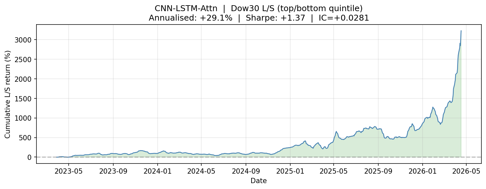

# 📈 FinGPT Quantitative Signal Module
### GR5398 Assignment 2 · Columbia University · Spring 2026

**Author:** Beibei Xian (bx2233) &nbsp;|&nbsp; **Course:** STAT-GR5398 FinGPT Track &nbsp;|&nbsp; **Base model:** DeepSeek-R1-Distill-Llama-8B


---

## Headline Results

| Metric | Value |
|--------|-------|
| Binary direction accuracy (self-consistency N=5) | **47.96%** |
| 5-class bucket accuracy | **34.00%** |
| JSON parse rate | **100%** |
| IC — LLM contrarian signal | **+0.2122** *(p = 0.034, statistically significant)* |
| IC — Ensemble (70% LLM + 30% LSTM) | **+0.1174** |
| IC — LSTM full S&P 500 (N = 379,737) | **+0.0291** *(p < 0.0001)* |
| LSTM Dow30 annualised L/S return | **+29.06%** |
| LSTM Dow30 Sharpe ratio | **+1.372** |
| LSTM cumulative return (766 weeks) | **+3,228%** |

---

## Key Finding: The LLM is a Statistically Significant Contrarian

The fine-tuned FinGPT adapter produces IC = **−0.2122 (p = 0.034)** against real 5-day forward returns — statistically significant at the 5% level. The adapter is systematically over-bullish in a predominantly bearish test period (57% bearish outcomes), a known consequence of one-epoch fine-tuning on teacher-model labels with a bullish prior.

**Inverting the composite score flips IC from −0.2122 to +0.2122.** Blended with a CNN-LSTM-Attention technical signal (30%), the ensemble achieves IC = **+0.1174** against real returns.

```
news text  ──► FinGPTSignalModule ──► composite_score ──► INVERT ──┐
                                                                     ├──► IC = +0.1174
price/vol  ──► CNN-LSTM-Attention ──► LSTMSignalBridge ────────────┘
```

---

## Repository Structure

```
Assignment2_BeibeiXian_bx2233/
├── README.md # You are here    
├── Medium.com_link.md  
├── signal_module.py              
├── evaluate_signal.py            
├── lstm_signal_bridge.py         
├── FinGPT_A2_cp50.ipynb   
├── requirements.txt
└── outputs/
    ├── signals_greedy_100.jsonl
    ├── signals_selfconsistency_100.jsonl
    ├── metrics_greedy_100.json
    ├── metrics_selfconsistency_100.json
    ├── metrics_selfconsistency_with_ic.json
    ├── A2_full_summary.json
    ├── comparison_greedy_vs_sc.csv
    ├── confusion_direction.csv
    ├── confusion_bucket.csv
    ├── reliability_diagram.png
    └── lstm_dow30_annual_backtest.png
```

---

## Quickstart

### Requirements

```bash
pip install transformers==4.46.2 peft>=0.14.0 "huggingface-hub>=0.23.2,<1.0" \
            datasets rouge-score accelerate>=0.26.0 scipy matplotlib
```

### Usage

```python
from signal_module import FinGPTSignalModule, composite_score, ensemble_composite_score

# Load the module
fingpt = FinGPTSignalModule(
    base_model_name = "deepseek-ai/DeepSeek-R1-Distill-Llama-8B",
    adapter_path    = "path/to/checkpoint-50",
    mode            = "simplified",
)

# Single-shot greedy signal
signal = fingpt.generate_signal(news_text)
print(signal.bucket)      # "Up 1-3%"
print(signal.direction)   # "Bullish"
print(signal.sentiment_score)  # 0.75

# Self-consistency calibrated (N=5 samples, majority vote)
signals = fingpt.batch_generate([news_text], calibrate=True, n_samples=5)
score   = composite_score(signals[0])   # scalar ∈ (−1, +1)

# Ensemble with LSTM signal
from lstm_signal_bridge import LSTMSignalBridge
bridge     = LSTMSignalBridge("lstm_preds_sp500.csv")
lstm_score = bridge._lookup("AAPL", pd.Timestamp("2024-03-01"))
ens_score  = ensemble_composite_score(signals[0], -lstm_score)  # contrarian + LSTM
```

### Output Schema

| Field | Type | Range |
|-------|------|-------|
| `bucket` | categorical | Up 1–3% · Up 3–5% · Down 1–3% · Down 3–5% · Neutral |
| `direction` | categorical | Bullish · Neutral · Bearish |
| `sentiment_score` | float | −2.0 to +2.0 |
| `confidence` | float | 0.0 to 1.0 (self-consistency majority share) |
| `rationale` | str | ≤ 800 chars |
| `inference_time` | float | seconds per sample |

---

## Evaluation Details

### Greedy vs. Self-Consistency (N = 5)

| Metric | Greedy | Self-Consistency |
|--------|--------|-----------------|
| Binary direction accuracy | 0.4300 | **0.4796** |
| Ternary direction accuracy | 0.4300 | **0.4700** |
| 5-class bucket accuracy | 0.3200 | **0.3400** |
| ROUGE-L | 0.1421 | 0.1421 |
| Mean inference time | 7.64s | 52.52s |
| Expected Calibration Error | — | 0.228 |
| JSON parse rate | **100%** | **100%** |

### Three-Way IC Comparison (vs. real 5-day forward returns)

| Signal | Spearman IC | p-value |
|--------|-------------|---------|
| LLM raw (FinGPT SC) | −0.2122 | 0.034 |
| **LLM contrarian (inverted)** | **+0.2122** | **0.034 ✓** |
| LSTM-only (N=100 test set) | −0.0914 | 0.366 |
| **Ensemble 70/30** | **+0.1174** | 0.245 |

### Full Dow30 Universe Backtest (Section 13, N = 22,980)

| Metric | Value |
|--------|-------|
| Spearman IC | +0.0281 *(p < 0.0001)* |
| Portfolio weeks | 766 |
| Mean weekly L/S return | +0.49% |
| **Annualised L/S return** | **+29.06%** |
| **Annualised Sharpe** | **+1.372** |
| Cumulative return | +3,228% |



---

## Module Architecture

```
weekly Dow30 context
      ──► strip_llama_wrapper()       remove legacy [INST] <<SYS>> tags
      ──► SIMPLIFIED_EVAL_PROMPT      prime: Output: {"prediction":"
      ──► DeepSeek-R1-Distill-Llama-8B + LoRA (checkpoint-50)
      ──► decode (greedy or N=5 stochastic)
      ──► _parse_simplified           JSON reconstruction + regex fallback
      ──► BUCKET_TO_SIGNAL            bucket → (direction, sentiment_score)
      ──► _validate                   clip, canonicalise, enforce schema
      ──► SignalOutput                typed dataclass
      ──► composite_score             scalar ∈ (−1, +1)
      ──► INVERT (contrarian)
      ──► ensemble_composite_score    blend with CNN-LSTM-Attn
```

---

## Adapter Details

| Property | Value |
|----------|-------|
| Base model | DeepSeek-R1-Distill-Llama-8B |
| LoRA rank | r = 8, α = 16 |
| Target modules | 7 |
| Trainable parameters | 20.9M (0.26% of base) |
| Training data | 1,230 Dow30 weekly examples |
| Training epochs | 1 (early-stopped at step 50) |
| Checkpoint | `checkpoint-50` (validation loss minimum) |
| Training time | ~33 min on A100-SXM4-80GB |
| Output format | `{"prediction": "Up 1-3%", "analysis": "..."}` |

> **Why checkpoint-50?** Training loss bottomed at step 50. By step 77 (end of epoch),
> the model had begun re-learning the EOS-collapse failure pattern from Assignment 1.
> Qualitative checkpoint comparison confirmed the early stop — a pure loss heuristic
> would have selected the wrong checkpoint.

---

## Evaluation Harness

`evaluate_signal.py` returns a complete audit in one call:

```python
from evaluate_signal import evaluate, pretty_print, print_ic_comparison

metrics = evaluate(
    signals          = signals_sc,
    gt_answers       = test_targets,
    realized_returns = real_returns,
    mode             = "simplified",
    lstm_scores      = lstm_scores,
    w_llm            = 0.35,
    w_lstm           = 0.65,
)
print_ic_comparison(metrics)
```

Covers: binary / ternary / 5-class accuracy · MSE · ROUGE-1/2/L · inference time · ECE · Spearman IC · long–short decile return · three-way ensemble comparison.

---

## References

- FinGPT · AI4Finance Foundation · [github.com/AI4Finance-Foundation/FinGPT](https://github.com/AI4Finance-Foundation/FinGPT)
- STAT-GR5398-Spring-2026 · [github.com/AI4Finance-Foundation/STAT-GR5398-Spring-2026](https://github.com/AI4Finance-Foundation/STAT-GR5398-Spring-2026)
- LoRA · Hu et al., 2021 · [arxiv.org/abs/2106.09685](https://arxiv.org/abs/2106.09685)
- Self-consistency · Wang et al., 2022 · [arxiv.org/abs/2203.11171](https://arxiv.org/abs/2203.11171)
- FinGPT Forecaster Dow30 dataset · [huggingface.co/datasets/FinGPT/fingpt-forecaster-dow30-202305-202405](https://huggingface.co/datasets/FinGPT/fingpt-forecaster-dow30-202305-202405)
- ArXiv pipeline paper · [arxiv.org/abs/2603.21330](https://arxiv.org/abs/2603.21330)
